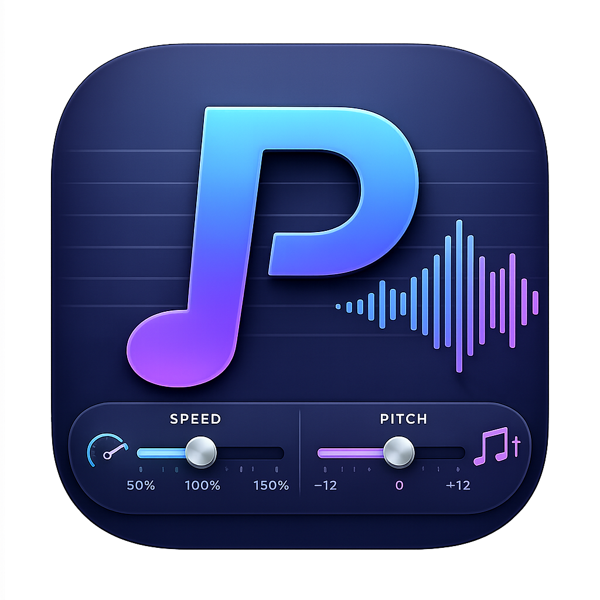
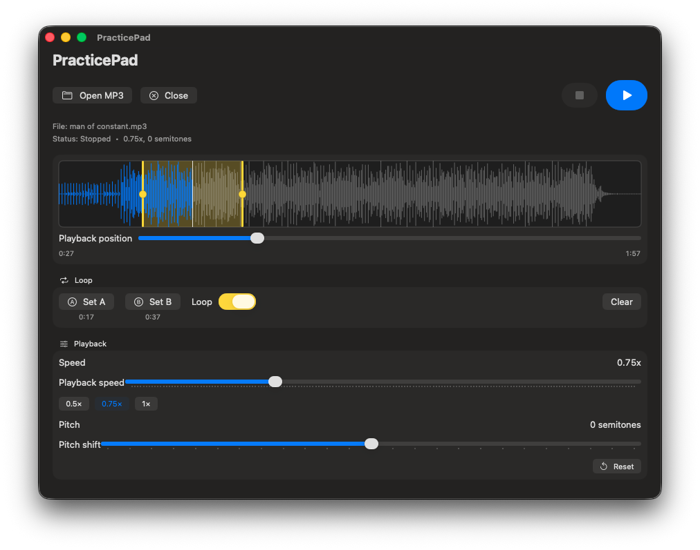

# PracticePad

A macOS app for practicing music by ear. Load an audio or video file, slow it down without changing the pitch (or shift the pitch without changing the speed), and loop a tricky passage over and over until you've got it. Video files play their picture alongside the same practice controls.

Built with SwiftUI and AVFoundation. Time-stretching and pitch-shifting are done by the [Rubber Band Library](https://breakfastquay.com/rubberband/): the decoded track is pulled through a `RubberBandStretcher` (real-time mode, R3 "finer" engine) inside an `AVAudioSourceNode`, then out through `AVAudioEngine`. A muted `AVPlayer`, slaved to the audio clock, provides the video picture.

> **Dependency & license note:** Rubber Band is required to *build* (install it with `brew install rubberband`; the build reads its headers and static library from the Homebrew prefix — `/opt/homebrew` on Apple Silicon, `/usr/local` on Intel). Rubber Band and its dependency libsamplerate are linked **statically** into the executable, so the built app does **not** require Homebrew to run — there are no dylibs to bundle. Rubber Band is distributed under the **GNU General Public License (GPL)**; linking it (statically or otherwise) means a distributed build of PracticePad is subject to the GPL unless you obtain a commercial Rubber Band license from Breakfast Quay.

<br clear="left" />



## Features

- **Audio & video** — open MP3, M4A, WAV, AIFF, MP4, M4V, or MOV. The audio track is played and processed even out of a video container.
- **Video playback** — video files show the picture in a pane you can resize (drag the handle) or send to full screen; the picture stays in sync with the pitch- and speed-shifted audio.
- **Speed control** — play from `0.25x` to `2.0x` without affecting pitch, with quick `0.5×` / `0.75×` / `1×` presets.
- **Pitch control** — shift `-12` to `+12` semitones without affecting speed.
- **Waveform view** — see the whole track; click to seek.
- **A-B looping** — gapless looping of a selected region, ideal for drilling a passage.
- **Drag-and-drop** — drop a supported audio or video file onto the window to load it.
- **Recent files** — reopen previously loaded tracks from the File menu.
- **Remembers your setup** — speed, pitch, the last file, its loop, and the video pane size are restored on launch.

## Using the app

### Load a track
- Click **Open** (⌘O), or drag a supported audio/video file onto the window.
- Reopen something you had before via **File ▸ Open Recent** (with **Clear Menu** to reset the list).
- **Close** unloads the current track and returns to the empty state.

### Watch video
- When the file has a video track, its picture appears in a pane above the waveform.
- **Resize** the pane by dragging the handle beneath it; the window grows to keep the other controls visible.
- Click the **full-screen button** (top-right of the picture) for a video-only view with minimal controls; press **Esc** (or the exit button) to return.
- All audio processing — speed, pitch, and A-B looping — applies to video files too. The picture reseeks to A at each loop wrap, so audio stays gapless while the image resyncs.

### Play and adjust
- **Play/Pause** with the button or the **spacebar**; **Stop** with the button or ⌘.
- Drag the **Speed** slider (or tap a preset) to slow the track down — pitch stays the same.
- Drag the **Pitch** slider to transpose in semitones — speed stays the same.
- **Reset** (↺, or ⌘R) restores speed to `1.00x` and pitch to `0`.

### Seek
- **Click** anywhere on the waveform, or drag the position slider, to jump to that spot.
- The elapsed / total time is shown under the waveform.

### Loop a section (A-B)
- **Drag across the waveform** to select a region — looping turns on automatically.
- Or use **Set A** / **Set B** to mark the in/out points at the current position, then toggle **Loop**.
- Fine-tune the region by dragging the **A** and **B** handles:
  - Dragging **A** restarts the loop at the new start.
  - Dragging **B** keeps playing from the current spot out to the new end, then loops.
- **Clear** removes the loop.

Jump back to the loop start anytime with **Go to A** (or the `Delete` key,
easy to reach one-handed while playing) — handy for restarting a passage you're
drilling. With no loop set, it jumps to the start of
the track.

Behavior notes:
- Seeking **inside** the loop keeps looping; seeking **outside** it plays straight through from the needle.
- **Stop → Play** always restarts the loop from **A**.

### Keyboard shortcuts

| Shortcut | Action |
| --- | --- |
| `⌘O` | Open a file |
| `Space` | Play / Pause |
| `⌘.` | Stop |
| `←` / `→` | Skip back / forward 1 second |
| `Delete` | Go to loop start (A) |
| `⌘R` | Reset speed & pitch |
| `Esc` | Exit full-screen video |

> Menus and shortcuts are only available when running the built `.app` (see below) — not via `swift run`.

## Building from source

Requires macOS 13+, a Swift toolchain (Xcode or the Swift command-line tools),
and the Rubber Band library:

```bash
brew install rubberband
```

### Run during development

```bash
swift build          # verify it compiles
swift run PracticePad
```

`swift run` is fine for quick checks, but it launches a bare executable with no
menu bar — use the packaged app below to test menus and keyboard shortcuts.

### Build an installable app

`scripts/make_app.sh` produces a release build wrapped in a proper, ad-hoc–signed
`.app` bundle. If `assets/icon.png` (1024×1024) exists, it's used as the app icon.

```bash
./scripts/make_app.sh
```

This creates `dist/PracticePad.app`. Install it by dragging it into `/Applications`, or:

```bash
cp -R dist/PracticePad.app /Applications/
```

Because Rubber Band and libsamplerate are linked **statically** into the
executable (see `Package.swift`), the finished `.app` is **self-contained** — it
runs on Macs that don't have Homebrew or Rubber Band installed, and there's no
`Contents/Frameworks` to manage. (Homebrew's `rubberband` is still needed to
*build*.)

The app is ad-hoc signed, which is fine for your own machine. To distribute
it to other Macs without Gatekeeper warnings you'd add a Developer ID signature
and notarization — and, because Rubber Band is GPL, comply with the GPL (or use
a commercial Rubber Band license).

## Project layout

- `Package.swift` — Swift package manifest.
- `Sources/PracticePad/PracticePadApp.swift` — app entry point and menu commands.
- `Sources/PracticePad/ContentView.swift` — main UI, transport controls, drag-and-drop, resizable/full-screen video.
- `Sources/PracticePad/WaveformView.swift` — waveform, seek, and loop handles.
- `Sources/PracticePad/VideoPlayerView.swift` — `AVPlayerLayer`-backed view for the video picture.
- `Sources/PracticePad/AudioPlayer.swift` — transport, seeking, A-B looping, video sync, persistence; drives the Rubber Band engine.
- `Sources/PracticePad/RubberBandEngine.swift` — `AVAudioSourceNode` pull loop feeding decoded audio through Rubber Band.
- `Sources/CRubberBand/` — module map exposing Rubber Band's C API (`rubberband-c.h`) to Swift; the static archives are linked by `Package.swift`.
- `Sources/PracticePad/FileImporter.swift` — open panel and supported audio/video types.
- `scripts/make_app.sh` — packages the `.app` bundle.
